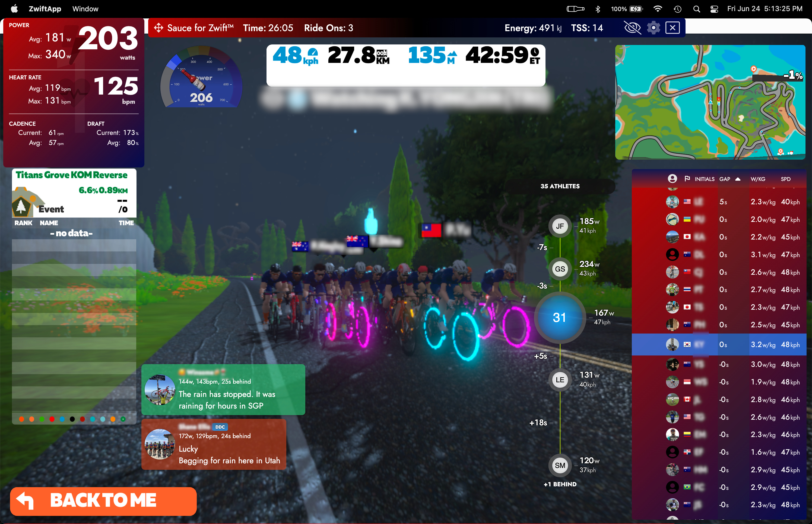
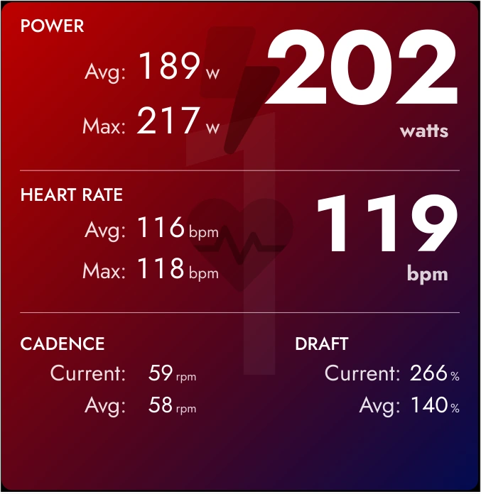

Sauce for Zwift™
===========

#### A collection of add-ons and replacement widgets for Zwift
Sauce for Zwift™ extends the Zwift cycling and running simulator with more stats and
pretty things.


Requirements:
--------
As of July 2022 Sauce is a full encrypted game client that "watches" your normal
Zwift account like a 2nd instance of Zwift itself.  As such, you'll need to create
a second login (free is fine).  Although a bit annoying this does allow you to
run S4Z on any device, anywhere.


Download for Mac / Windows / Linux:
--------
https://www.sauce.llc/products/sauce4zwift/download


--------



Great overview video from Si Bradeley...

[](https://www.youtube.com/watch?v=NZNgZW6YCp0)


Feature Highlights
--------
 * Draft power savings:
   * See how much power you're saving by being in the draft.
 * Groups view:
   * See the size of your group and others nearby
   * Show the time gap to the groups ahead and behind
   * Accurate gap measurement with virtual checkpoints.  All road positions are
     continually recorded with timestamps for all nearby riders.  The gaps are
     real values from when riders crossed the same point.  Geometric based estimates
     are only used as a fallback when road positions are not yet available (rare).
 * Real stats:
   * Average and Max for power, HR, cadence, speed and event draft
   * Rolling Averages (5s, 5min, etc) for most metrics (power, hr, etc)
   * Peak Averages (5s, 5min, etc) for most metrics (power, hr, etc)
   * [NP®](#tp), [TSS®](#tp), kJ
   * Laps
 * Map with full route preview:
   * See the elevation profile for the route you are on
   * Interactive zoom and pan
   * Optional perspective tilting
   * Chat bubbles appear over athletes sending messages
 * Controllable by event organizers:
  * Add hashtags to your event description to control Sauce for athletes in your event
 * Highly configurable:
   * Dynamic scaling of almost every component to suit all needs
   * Chroma key support for OBS streamers
   * Almost every field can be changed
   * Pick and choose which windows you want visible and configure each of them with unique custom settings
 * Gauges:
   * Power (with zones), Draft, Speed, HR
 * Improved chat client:
   * Avatar
   * Gap to athlete
   * Real time power, hr of athlete
   * Support for muting specific athletes
 * Nearby riders/runners table with extensive field options.
 * Built-in Web server allows access to most of the widgets.
   * Port 1080 (configurable) e.g. http://localhost:1080
   * REST / WebSocket API for programmers (See /api for a directory)
 * Mods / Plugins supported
   * See https://github.com/saucellc/sauce4zwift-mod-example for details


Headless mode (ADVANCED):
--------
Sauce can run as a standalone web server if you don't need or want the overlay window
capabilities.  You will need to provide credentials via the command line or through
shell environment variables.  Full usage details are given when your run Sauce
with the arguments `--headless` and `--help`.  For example...
```shell
$ ./sauce4zwift-1.1.4-dev.AppImage --headless --help
Usage: ./sauce4zwift-1.1.4-dev.AppImage [--headless] --main-username USERNAME
  --main-password PASSWORD --monitor-username USERNAME --monitor-password PASSWORD
  [--athlete-id ATHLETE_ID] [--random-watch [COURSE_ID]]
  [--disable-game-connection] [--debug-game-fields] [--help]

Arguments:
  --headless                      Run in headless mode.  NOTE: All settings for
                                  headless mode are separate from normal mode.
  --main-username USERNAME        The main Zwift username (email)
                                  (env variable: MAIN_USERNAME)
                                  [REQUIRED]
  --main-password PASSWORD        The main Zwift password
                                  (env variable: MAIN_PASSWORD)
                                  [REQUIRED]
  --monitor-username USERNAME     The monitor Zwift username (email)
                                  (env variable: MON_USERNAME)
                                  [REQUIRED]
  --monitor-password PASSWORD     The monitor Zwift password
                                  (env variable: MON_PASSWORD)
                                  [REQUIRED]
  --athlete-id ATHLETE_ID         Override the athlete ID for the main Zwift
                                  account
  --random-watch [COURSE_ID]      Watch random athlete; optionally specify a
                                  Course ID to choose the athlete from
  --disable-game-connection       Disable the companion protocol service
  --debug-game-fields             Include otherwise hidden fields from game data
                                  [default=true]
  --help                          Show this info about args
```

```shell
$ MON_PASSWORD=secret MAIN_PASSWORD=othersecret ./sauce4zwift-1.1.4-dev.AppImage \
    --headless \
    --main-username foobar@gmail.com \
    --monitor-username foobar+sauce@gmail.com
...
Startup took 385ms
Web server started at: http://192.168.17.100:1080/
  HTTP API at: http://192.168.17.100:1080/api
  WebSocket API at: ws://192.168.17.100:1080/api/ws/events
Web server started at: https://192.168.17.100:1081/
  HTTP API at: https://192.168.17.100:1081/api
  WebSocket API at: wss://192.168.17.100:1081/api/ws/events
...
```


Event Organizer Hashtags
--------
**For Event Organizers only:**
Control Sauce behavior for your events with these tags:
https://www.sauce.llc/products/sauce4zwift/event_hashtags


Release Notes
--------
https://www.sauce.llc/products/sauce4zwift/release_notes


Support my work
--------
<a href="https://www.patreon.com/bePatron?u=32064618" target="_blank">
    
</a>


Disclaimer
--------
I don't work for Zwift nor do I represent them.  I assume no liability bla
bla bla.  You get the idea.


Attribution
--------
 * <a id="tp"></a> Normalized Power®, NP®, Training Stress Score®, TSS®,
   Intensity Factor®, IF® are trademarks of TrainingPeaks, LLC and are used with permission.

   Learn more at <a href="https://www.trainingpeaks.com/learn/articles/glossary-of-trainingpeaks-metrics/?utm_source=newsletter&utm_medium=partner&utm_term=sauce_trademark&utm_content=cta&utm_campaign=sauce">https://www.trainingpeaks.com/learn/articles/glossary-of-trainingpeaks-metrics/</a>.


Legal
--------
[Privacy Policy](https://www.sauce.llc/legal/sauce4zwift-privacy.html)
[Terms and Conditions](https://www.sauce.llc/legal/sauce4zwift-terms.html)
